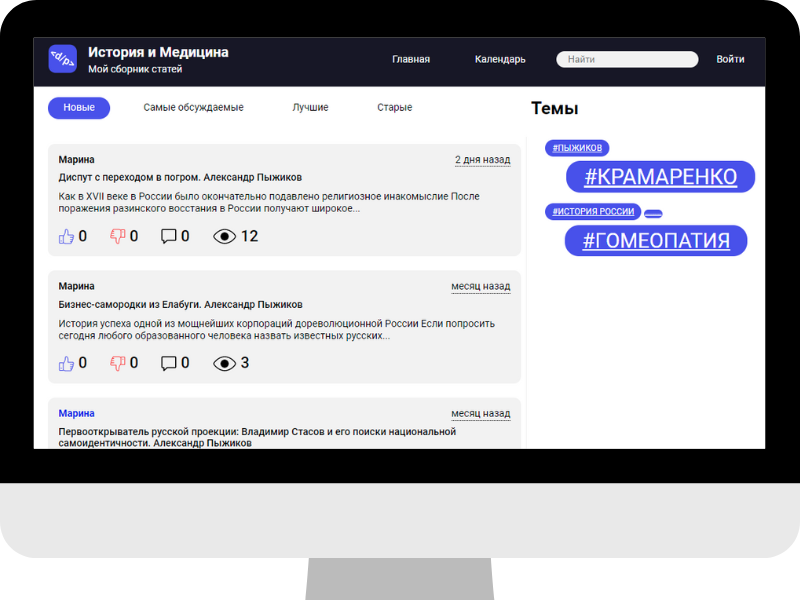

# Blog Engine Backend

This is the final project on the SkillBox course - Java Developer PRO

## Project Description

In this project, the backend of the blog engine is implemented.

Main functions:
* adding posts
* display of posts on the main page with sorting by various parameters
* display of posts on the main page by tag
* search by posts
* single-user and multi-user operation mode
* user registration
* post moderation
* likes and dislikes of posts
* adding comments to post

The engine allows you to conveniently sort posts, display them depending on the number of likes, comments, or simply by publication date.
There are also tags by which you can quickly display only the posts you are interested in, which greatly facilitates the search for publications you are interested in.
Moderation of posts is implemented in the engine. Depending on the global settings, the post can be immediately included in the general publication, or it can be checked by the administrator and only after verification and approval can it be shared.
There is a personal account where you can customize your avatar, change your email or password if necessary.
There you can edit your posts, hide or delete them.

## Demo
***
The application is available in real time via the link: https://kapriz-java-skillbox.herokuapp.com/
***

## Main stack technology:
* Java 11
* Apache Maven
* Spring Boot FrameWork
* Spring Security
* Spring Data
* MySQL 8
* Hibernate
* MockMvc

## Additional features:
* Cage (Captcha Generator)
* Spring Mail
* Jsoup (HTML Parser)
* Imgscalr (Java Image Scaling Library)
* Lombok
* Log4j2
* Jackson

***

I will be glad to receive any feedback: dkapriz098@gmail.com
